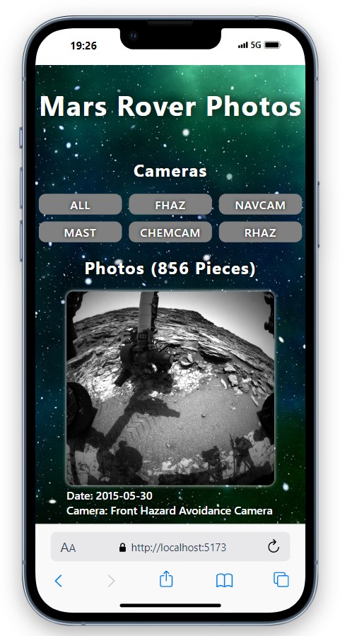
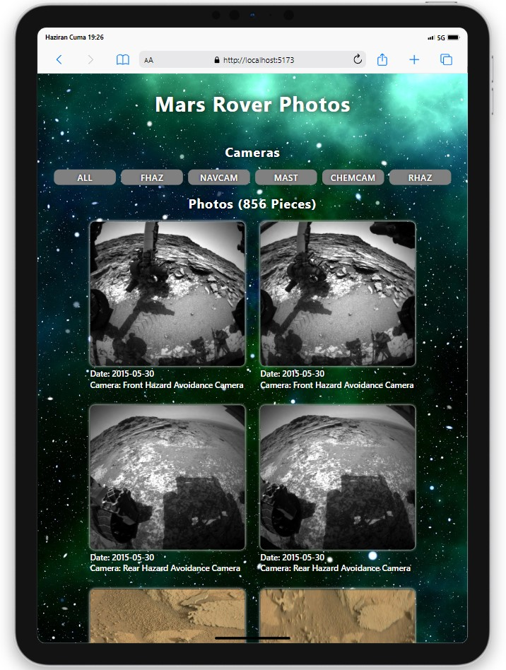
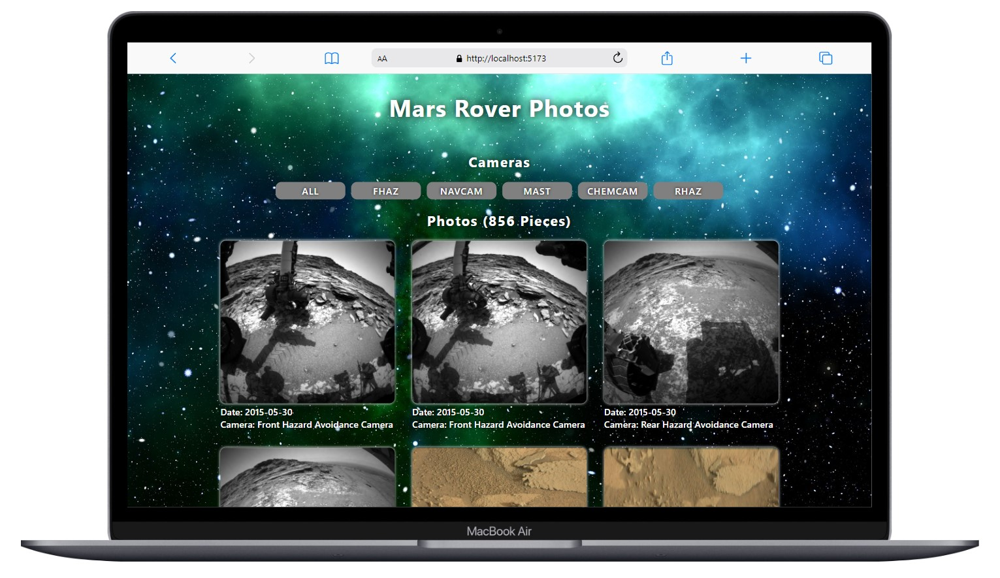

# Mars Rover Photos

<div align="center">
  
</div>

## About the Project

**Mars Rover Photos** is a web application that displays photos taken by NASA's Mars Rovers. Users can filter photos based on the specific cameras that took them and explore the images.

This project is built using React and Vite. It integrates with NASA's Mars Rover API to fetch real-time photo data.


## Table of Contents

- [Features](#features)
- [Technologies Used](#technologies-used)
- [Project Skeleton](#project-skeleton)
- [Screenshots](#screenshots)

## Live Demo

[Mars Rover Photos](https://mars-rover-photos-rust.vercel.app/)

## Features

- Integration with NASA's Mars Rover API
- Filtering photos by specific rover cameras
- Lazy loading for performance optimization
- Developed with modern React features and ES6+

## Technologies Used

- **React**: For building the user interface.
- **Vite**: For fast development server and build tooling.
- **Axios**: For making API requests.
- **ESLint**: For code quality and linting.
- **NASA Mars Rover API**: To fetch Mars Rover photos.

## Project Skeleton

```
Mars Rover Photos (folder)
│        
├── public
├── src
│    ├── assets
│    │     └── [images]
│    ├── components      
│    │     └── Card.jsx  
│    ├── pages
│    │     └── Home.jsx 
│    ├── App.jsx
│    ├── index.css
│    └── main.jsx
├── .eslintrc.cjs
├── .gitignore
├── index.html
├── package-lock.json
├── package.json
├── README.md
└── vite.cpnfig.js
```

## Screenshots

<div align="center">
  
  
  
</div>

## Compatibility

The project is compatible with both wide-screen computers and mobile devices.

## Acknowledgments

Products data provided by [Nasa API](https://api.nasa.gov/)